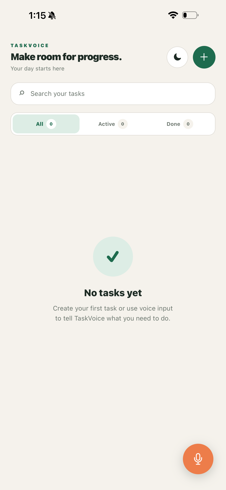
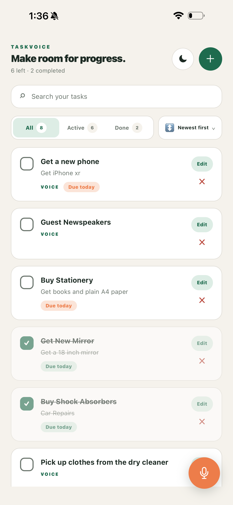
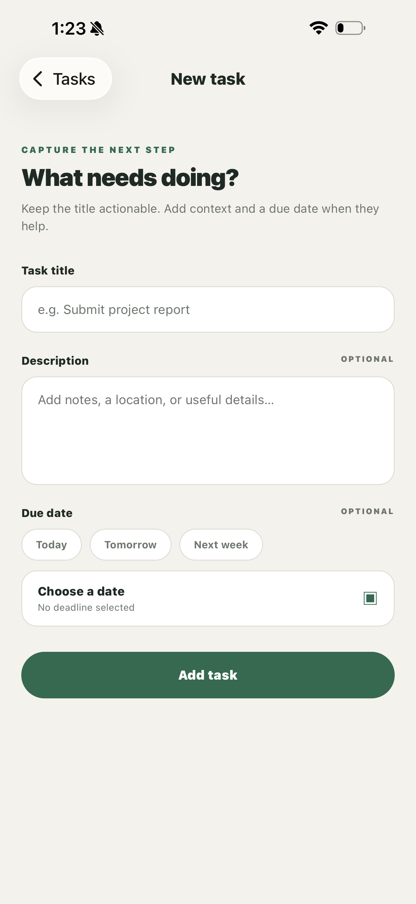
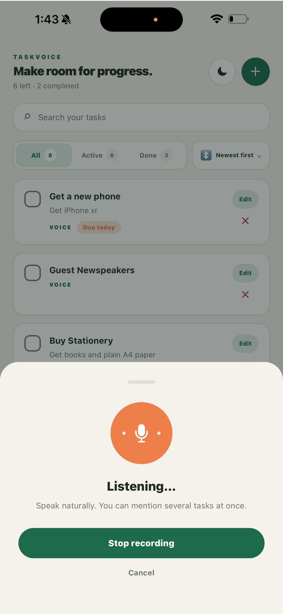
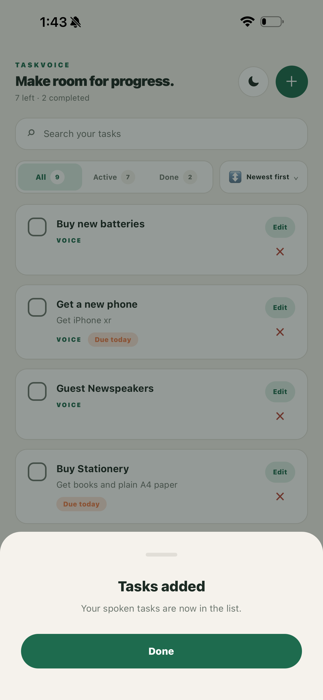
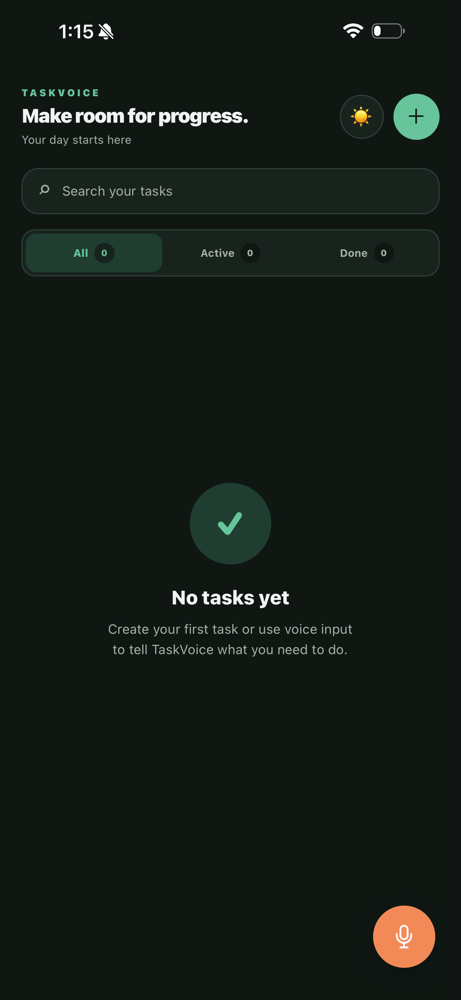
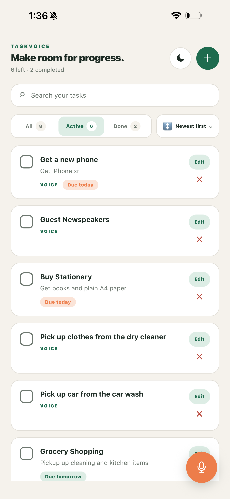
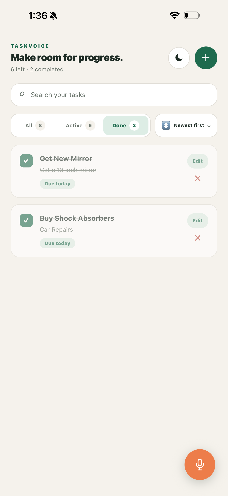
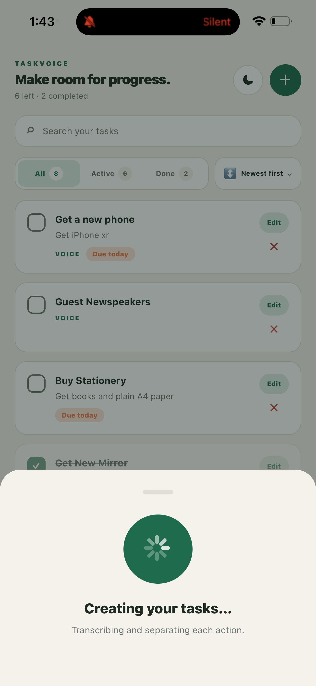

# TaskVoice

TaskVoice is a polished, local-first React Native task manager for capturing work by typing or speaking. A single recording such as “Buy provisions, call Mum, and submit the report” becomes three separate tasks.

## Features

- Create tasks with a required title and optional description
- Edit the title, description, and due date of manual or voice-created tasks
- Add due dates with quick picks or the native calendar
- Complete, reopen, search, filter, sort, and delete tasks
- Persist all changes locally with AsyncStorage
- Switch between persisted light and dark themes
- Record voice with clear permission, listening, processing, success, and error states
- Securely transcribe and extract multiple tasks through a backend proxy
- Preserve the full transcript as one task if AI extraction fails
- Accessible labels, large touch targets, empty states, and resilient stored-data validation
- Strict TypeScript and unit tests for central business rules

## Screenshots

These full-screen captures come from the app running in Expo Go on a physical
iPhone. The complete labeled gallery and asset index are available in
[`screenshots/README.md`](screenshots/README.md).

| Empty task list | Mixed completed and incomplete tasks | Add task |
|---|---|---|
|  |  |  |

| Voice input active | Tasks produced by voice | Dark theme |
|---|---|---|
|  |  |  |

| Active filter | Completed filter | Voice processing |
|---|---|---|
|  |  |  |

The end-to-end voice flow is also available as a
[short MP4 screen recording](screenshots/10-voice-task-demo.mp4).

## Stack

- Expo 54, React Native 0.81, React 19, TypeScript
- React Navigation native stack
- AsyncStorage
- Expo Audio
- Node.js, Express, Multer
- Groq-hosted `whisper-large-v3` for high-accuracy speech-to-text and `openai/gpt-oss-20b` structured output for task extraction
- Jest

## Architecture

The mobile app uses Context plus `useReducer`. Screens call a small task API exposed by `TaskProvider`; the reducer owns deterministic state transitions, while the storage service owns serialization. Hydration must finish successfully before automatic saves begin, preventing an empty initial state from overwriting saved tasks.

Due dates are stored as local date-only values (`YYYY-MM-DD`) so a deadline does not move to another day when the device timezone changes. Theme preference is stored independently and defaults to the current system appearance on first launch.

React Navigation provides the required Task List and Add Task experiences. The
Edit Task route reuses the Add Task form rather than duplicating a third screen
implementation.

Voice processing is deliberately split into two steps:

1. Audio transcription answers “what was said?”
2. Structured extraction answers “which separate actions were said?”

The API key exists only in the Node server. The mobile bundle receives a public backend URL, never a Groq credential. The backend validates file presence, type, and size, requests structured JSON, deduplicates task titles, and falls back to the transcript when extraction fails.

## Setup

Requirements: Node.js 20.19+ and npm, plus Expo Go or an Android/iOS simulator.

```bash
npm install
cp .env.example .env
npm --prefix server install
cp server/.env.example server/.env
```

Set `GROQ_API_KEY` in `server/.env`. Set `EXPO_PUBLIC_VOICE_API_URL` in the root `.env`:

- iOS simulator: `http://localhost:3001`
- Android emulator: `http://10.0.2.2:3001`
- Physical device: `http://<your-computer-LAN-IP>:3001`

The device and computer must share a network for a LAN URL. Never commit either `.env` file.

Start the backend:

```bash
npm run server
```

In another terminal, start Expo:

```bash
npm start
```

Press `i` for iOS, `a` for Android, or scan the QR code with Expo Go. Restart Expo after changing `EXPO_PUBLIC_*` values.

## Verification

```bash
npm run typecheck
npm test
npm --prefix server run typecheck
```

Manual release checks:

1. Add a task with and without a description.
2. Confirm whitespace-only titles show validation.
3. Toggle a task, restart the app, and confirm its state remains.
4. Cancel and confirm deletion.
5. Deny microphone permission and verify recovery guidance.
6. Record one task, then several actions in one sentence.
7. Stop the backend and verify the network error.
8. Search titles/descriptions and exercise all filters.
9. Add tasks due today, tomorrow, and next week; exercise every sort option.
10. Switch themes, restart the app, and confirm the selected theme returns.
11. Edit a manual and a voice-created task; confirm its source and completion state remain intact.

## API contract

`POST /api/voice-tasks`, multipart field `audio`:

```json
{
  "transcript": "Buy provisions and call Mum",
  "tasks": [
    { "title": "Buy provisions" },
    { "title": "Call Mum" }
  ]
}
```

`GET /health` returns `{ "status": "ok" }`.

## Decisions and trade-offs

- A native stack fits the required list → form → list flow; tabs add no value.
- Context/reducer is enough for two screens and keeps state transitions testable without Redux ceremony.
- A single AsyncStorage JSON array is simple and adequate for a personal list. Large datasets or cloud sync would warrant a database.
- Recorded files are buffered in memory on the server for a small interview app. Production should stream uploads to temporary object storage, authenticate callers, rate-limit, restrict CORS, add request IDs, and apply retention controls.
- Groq keeps both transcription and structured task extraction within its free-plan limits for development and demonstration. Provider limits can change, so a production deployment should monitor usage and make model selection configurable.
- Search and filters are implemented because they improve the review experience without complicating the task model.
- Date-only storage avoids timezone drift, while undated tasks stay after dated tasks in due-date sorts.
- A semantic two-palette theme keeps every screen, modal, navigation surface, and status bar consistent.

## Exercise coverage

The implementation covers every mandatory requirement in the July 2026 AAIR
Labs Developer Exercise:

| Exercise requirement | Implementation |
|---|---|
| Add tasks with title and optional description | Validated Add Task form |
| Complete and reopen tasks | Accessible checkbox control with visual distinction |
| Delete tasks | Native destructive confirmation |
| Display all tasks | Persisted `FlatList` task view |
| Persist between launches | AsyncStorage with guarded hydration |
| Task List and Add Task navigation | React Navigation native stack |
| Empty-title and no-task edge cases | Inline validation and dedicated empty state |
| Voice input from a FAB | Expo Audio recording workflow |
| Speech-to-text API | Groq-hosted Whisper through a server-side proxy |
| Split natural-language dictation | Structured task extraction with deduplication and transcript fallback |
| Required screenshots | Physical-iPhone PNG captures embedded above |

All listed bonus areas are also represented: due dates and sorting, search and
filtering, a persistent light/dark theme, TypeScript, unit tests, and native
screen/modal transitions.

## Known limitations

- No authentication, cloud sync, notifications, or offline voice transcription
- Voice requires the backend, internet access, and a configured Groq account
- Delete confirmation uses the native alert, whose appearance varies by platform

## Future improvements

- Undo deletion and optional task reminders
- Backend authentication, rate limits, telemetry, and automated route tests
- End-to-end tests on iOS and Android
- Configurable language hints and user confirmation before adding extracted tasks
- Encrypted cloud sync and multi-device conflict resolution

## Repository map

```text
src/components    Reusable interface pieces
src/screens       Task list and reusable add/edit form
src/context       Shared task state and reducer
src/hooks         Task and recording workflows
src/services      Persistence and backend client
src/utils         Pure validation/normalization helpers
server/src        Secure voice endpoint and Groq services
tests             Reducer and validation tests
screenshots       Physical-device gallery and voice demo
```

## Privacy

Manual tasks stay in AsyncStorage on the device. Voice audio and its transcript are sent to the configured TaskVoice backend and Groq for processing. A production release should present this clearly in an in-app privacy notice and publish a retention policy.
